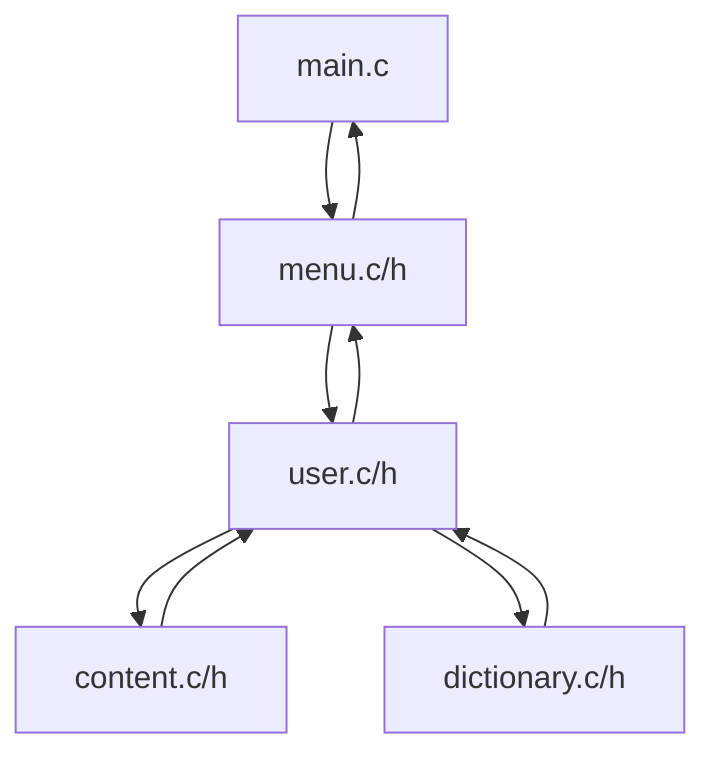
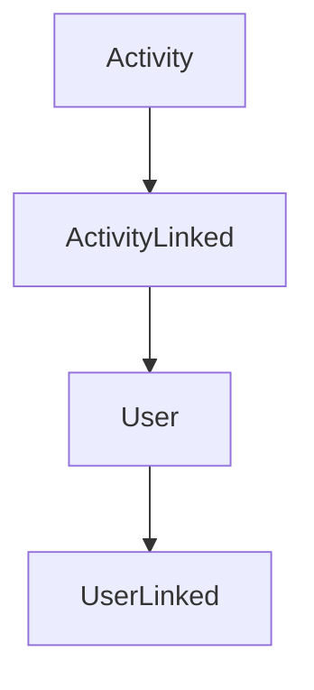
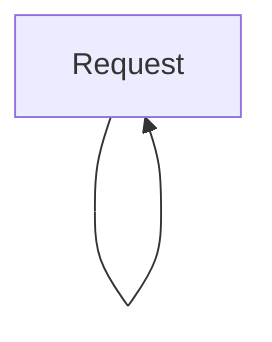
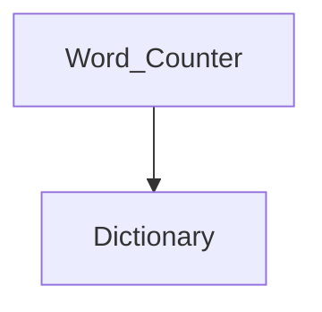
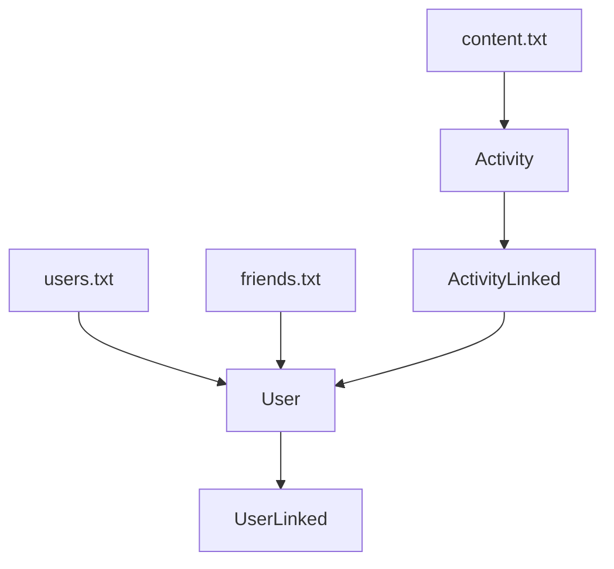
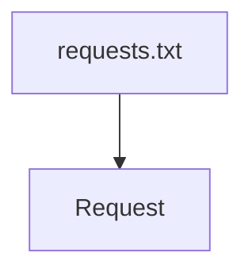

# ESTRUCTURAS DE DATOS Y ALGORITMOS II, 2022-2023
#### CULTURE LOVERS, para los amantes de la cultura

Marc Rodríguez Rodríguez - 267283

Jordi Rubio Arbona - 266987

Àlex Torra Cabrera - 268168

08/06/2023

---
## LISTA DE CONTENIDOS
+ 1. INTRODUCCIÓN
+ 2. OBJETIVOS DEL PROYECTO
    + 2.1. Objetivos obligatorios alcanzados
    + 2.2. Objetivos deseables alcanzados
    + 2.3. Objetivos exploratorios adquiridos
+ 3. SOLUCIÓN
    + 3.1. Arquitectura del sistema
    + 3.2. Gestión de errores
    + 3.3. Diseño del modelo de datos
    + 3.4. Descripción y procesamiento del conjunto de datos
+ 4. REFERENCIAS
    + 4.1. Uso de inteligencia artificial	

---
## 1. INTRODUCCIÓN 
**Culture Lovers** es una red social donde los usuarios pueden publicar opiniones sobre viajes, hoteles, gastronomía, monumentos y actividades culturales. En sus inicios, este proyecto podría parecer ambicioso, pero los resultados han sido verdaderamente acertados.

Una de las principales dificultades que se nos han presentado en la programación de esta red social ha sido la gestión de datos, su inicialización y almacenamiento. Sin embargo, hemos logrado superarlas con el uso de archivos externos .txt, que permiten guardar información y escanearla de manera relativamente cómoda. Además, nos hemos aprovechado de varias estructuras y listas enlazadas  para trabajar con los datos una vez iniciada la ejecución. Cabe destacar que también nos ha resultado útil la definición de constantes con las direcciones de los archivos correspondientes, ya que hemos podido trabajar con ellas de manera más concisa.

Por otro lado, tratándose de una red social “offline”, uno de los problemas que se nos planteó fue el control de los usuarios. La solución que hemos decidido aplicar ha sido añadir una contraseña en los datos de usuario, que permite simular de manera más realista el inicio de sesión de un usuario en particular.

En cuanto a la parte estética de la red social, hemos usado una constante BARS, que contiene un string de virgulillas (“~”) para separar los distintos apartados y menús. Además, también hemos usado los valores ascii de ciertos símbolos (“♥”, “♣”) y caracteres especiales (“¡”, “á”, “é”, “ó”) para dotar el programa de una apariencia más atractiva.

En último lugar, cabe decir que se han superado todas las adversidades encontradas a lo largo del proyecto, se ha obtenido una red social funcional y atractiva para la experiencia del usuario. A lo largo del informe encontraréis más información al respecto.

---
## 2. OBJETIVOS DEL PROYECTO 
### 2.1. Objetivos obligatorios alcanzados 
**1. Lista, pila y cola:**
Hemos usado diferentes estructuras de datos para este proyecto:

+ Listas:

    Función init_list.
    
    + Esta función no recibe variables. En un principio recibía el nombre del archivo correspondiente a los usuarios (“users.txt”), pero finalmente definimos una constante (FILE_USERS) con la dirección, que permite usar un código más claro y sencillo. Esta función lee los datos de cada usuario, fila por fila, y devuelve una lista enlazada de usuarios (UserLinked*), que nos permite ensancharla, reducirla y recorrerla a lo largo del programa —de hecho, la lista enlazada de usuarios se usa en gran parte de las funciones, como: init_friends, init_queue, fill_profile y make_user_linked, entre otras—.
Además de usar la lista enlazada UserLinked, también trabajamos con la estructura User (ambas definidas en user.h, en las líneas 43-60).

    + Una de las principales limitaciones de esta función es que el escaneo de los usuarios es lineal —si hubiese muchos usuarios, tardaría demasiado en escanear todo el archivo “users.txt”—, y si algún usuario contiene datos erróneos, probablemente los siguientes no se escanearán. Además, dentro de esta función, implementamos make_user_linked (para la creación de la lista enlazada), teniendo que completar todos los datos de cada usuario.
Hemos tardado alrededor de 2h.

    + La función se encuentra en user.c (líneas 233-254).

+ Pilas:

    + En nuestro proyecto hemos usado una pila para calcular el tiempo que pasa un usuario con la sesión iniciada y el tiempo que pasa una persona con la red social abierta. Es importante entender la diferencia entre estos dos casos. El tiempo que pasa un usuario con su sesión iniciada empieza a calcularse cuando el usuario pone su username y su contraseña para iniciar sesión y acaba cuando el usuario selecciona la opción de cerrar sesión en el menú. Sin embargo, el tiempo total en la red social se calcula desde que el código se empieza a ejecutar hasta que la persona selecciona la opción salir en el menú, por lo que si la persona inicia sesión con un usuario, luego cierra la sesión de ese y abre la de otro, el contador sigue en curso. Para calcular el tiempo, usamos clock(), que cada vez que se llama a esta función guardamos en una variable el tiempo que ha transcurrido en la CPU, por lo que solo tenemos que restar el tiempo al final y al principio. Si nos fijamos en el orden de llamadas a la función, sería de la siguiente manera. Primero, llamamos a la función para empezar a contar el tiempo total en la red social. Si luego, como es normal, iniciamos sesión, estaríamos llamando a la función para empezar a contar el tiempo con la sesión iniciada. Ahora, ya sea para cambiar a otro usuario o para salir de la aplicación, antes habría que cerrar sesión, por lo que llamaríamos a la función para saber el tiempo final en una sesión. Ya para acabar, cerraríamos sesión y llamaríamos a la función clock() para saber el tiempo final del total de tiempo en la red social. 
Si nos fijamos en esta estructura, necesitaremos que, de alguna manera, se recogieran los valores de tiempo en orden inverso a como los hemos llamado. Es así como llegamos a la necesidad de usar una pila. Al llamar a clock() la primera vez, guardamos ese valor de tiempo en el fondo de la pila, y al llamarla por segunda vez (para empezar a contar el tiempo en una sesión), guardamos este segundo valor también en la pila. Como tendremos que cerrar la sesión antes de poder salir de la aplicación, llamamos a la función por tercera vez (para tener el tiempo final que hemos estado en la sesión) y hacemos un top para obtener el último valor que habíamos guardado en la pila, que es el tiempo inicial de la sesión. En este punto solo nos queda restar el final menos el inicial. Entonces, mediante el mismo procedimiento, lo haríamos con el tiempo total en la aplicación. 
Si no usáramos una pila, nos tendríamos que ayudar de muchas variables para ir guardando valores de tiempo, por lo que en este caso la pila es lo más eficiente. 

    + Hemos tardado alrededor de 1 hora.

    + Las funciones auxiliares asociadas a la pila las encontramos en las líneas 123-166 del archivo menu.c.

+ Colas:

    Función init_queue.

    + Esta función recibe un puntero al primer usuario de todos (UserLinked*) —dentro de la función, llamaremos a make_request, donde comprobaremos que los nombres de usuario sean correctos y guardaremos la solicitud en una lista enlazada de tipo Request*—. De manera similar a otras funciones de inicialización, se usa una constante (FILE_REQUESTS) con la dirección del archivo correspondiente (“requests.txt”). Esta función lee los datos de cada solicitud de amistad, fila por fila, y devuelve una lista enlazada de peticiones (Request*). Inicialmente, teníamos pensado crear una cola de solicitudes por cada usuario, pero pensamos que, por ahora, sería más eficiente tener una sola lista enlazada para todos los usuarios —debido a que no habrá tantas solicitudes por usuario, y una cola por cada usuario ocuparía más memoria—, es por ello que, a pesar de que en su origen la estructura Request* seguía la lógica de colas (init_queue, enqueue, dequeue), actualmente es más bien una lista enlazada común, con ciertas funcionalidades de cola. Por lo tanto, idealmente cada usuario debería tener una estructura de solicitudes —esta vez sí enteramente de tipo cola, donde se fuesen aceptando o rechazando las peticiones por orden de entrada— en su perfil.
Similarmente a las otras funciones de inicialización, una de las principales limitaciones de esta función es que el escaneo de las solicitudes es lineal —si hubiese muchas solicitudes, tardaría demasiado en escanear todo el archivo “requests.txt”—, y si algún usuario contiene datos erróneos, los siguientes no se escanearán. Además, dentro de esta función, implementamos make_request (para la creación de la lista enlazada), teniendo que comprobar que los usuarios sean correctos —comprobamos que no se haya enviado o recibido solicitud de esa persona repetidamente y que los dos usuarios no sean amigos—, teniendo que recorrer la lista de tipo UserLinked* para llevarlo a cabo.
Hemos tardado alrededor de 1h 30 min.

    + La función se encuentra en user.c (líneas 312-364).

**2. Algoritmos de búsqueda:**

Hemos implementado el algoritmo de búsqueda LinearSearch en una función auxiliar llamada search_user. Como el nombre indica, esta función tiene como objetivo buscar un usuario entre todos los usuarios de la red social. La función search_user ha sido usada en varias otras funciones, como puede ser fill_profile (con el objetivo de que los nombres de usuario no se repitan) o make_request (para buscar un usuario al que mandarle una petición de amistad). La función search_user recibe como parámetros el username a buscar y un puntero al primer usuario de la lista de usuarios de la red social. De esta manera, creamos un bucle en el cual, mientras el usuario no sea nulo, vamos comparando los username de la lista de usuarios con el username recibido. Si no coinciden los usernames, avanzamos a comparar con el siguiente usuario. Si encontramos dos usernames que coincidan, se devuelve un puntero a la estructura del usuario enlazado encontrado. La única limitación que podría tener esta función sería en el caso de que nuestra red social tuviese una enorme cantidad de usuarios, ya que entonces tardaría mucho tiempo en recorrerlos uno a uno. En ese caso, se podría mejorar la función search_user haciendo que se usase una BinarySearch en vez de una LinearSearch.

Para alcanzar este objetivo, hemos necesitado alrededor de 30 minutos. 

Nuestra función search_user, que usa el algoritmo de LinearSearch, se encuentra en las líneas 589-598 del archivo user.c.

**3. Algoritmo de ordenación:**

El algoritmo de ordenación que hemos implementado es MergeSort, y lo hemos usado para ordenar de más a menos cuáles son las palabras que más se usan en las publicaciones. Lo hemos hecho mediante dos funciones: merge y mergeSort. La primera de ellas recibe una estructura de diccionario y 3 índices (el del primer elemento, el del elemento central y el del elemento de la derecha) y fusiona dos subarrays ordenados. La función mergeSort, que es recursiva, ordena recursivamente las mitades izquierda y derecha y luego mediante la función merge fusiona los dos subarrays ordenados. Finalmente, estas dos funciones son incluidas en la función counter_of_words, que es la que se encarga de separar las palabras, introducirlas en el diccionario y ordenarlas por uso mediante la función mergeSort. Una de las limitaciones que tiene es que si hay pocas palabras en el diccionario, se tarda demasiado tiempo innecesario en ordenarlas. En ese caso, sería mejor usar otro algoritmo de ordenación, como por ejemplo SelectionSort o InsertionSort. 

Implementar este algoritmo no ha llevado alrededor de 1 hora.

La función merge se encuentra en la línea 34 del archivo dictionary.c y la función mergeSort se encuentra en la línea 96 del mismo archivo.

**4. Diccionario:**

También hemos implementado la funcionalidad de un diccionario. Primero, hemos creado la función init_dictionary, que recibe como parámetro un tamaño y crea un diccionario de ese tamaño. Después, hemos creado la función counter_of_words. Esta función es por la que pasamos las publicaciones de cada usuario, y ella se encarga de separar las palabras de la publicación. Una vez tiene una palabra separada, si ya está incluida en el diccionario aumenta el número de veces que esa palabra se usa y si no lo está la añade al diccionario. Y así sucesivamente con cada una de las palabras de la publicación. Finalmente, ordenará las palabras de más a menos según su uso mediante la función mergeSort e imprime las 10 palabras más usadas. Esta función recibe como parámetros un fichero con las publicaciones y un puntero al diccionario en el que añadiremos las palabras y contaremos cuántas veces se repiten. La limitación de este diccionario es que tiene un número limitado de palabras que le podemos añadir. En nuestro caso, hemos pensado que 1000 palabras serían suficientes. En caso de que no lo fuera, lo ideal sería crear el diccionario mediante memoria dinámica, o en su defecto, cada vez que se requiera añadir una palabra estando ya el diccionario lleno, se eliminase la palabra menos usada del diccionario. 

La implementación de esta funcionalidad nos ha requerido alrededor de 90 minutos.

La función init_dictionary está en la línea 17 del archivo dictionary.c y la función counter_of_words en la línea 114 del mismo archivo. 

**5. Comentar el código** y **6. Usar github:**

Todas las partes importantes del código están comentadas correctamente. Por otro lado, cabe decir que principalmente hemos colaborado con la funcionalidad “Code With Me” de CLion y uno de los miembros del grupo ha ido actualizando el código. En un principio, trabajamos conjuntamente con GitHub (usando “pull” y “push”), pero más adelante tuvimos dificultades para seguir usándolo (debido al uso de archivos externos .txt y a errores de compatibilidad). Por ello, los commits contienen la fecha de la sesión y el nombre de usuario de los miembros participantes.

### 2.2. Objetivos deseables alcanzados
**1. Leer datos de una fuente externa**

Hemos implementado la funcionalidad de leer datos de una fuente externa, como es un archivo de texto. Esto lo usamos por ejemplo para añadir un grupo de usuarios a la red social. Tenemos un archivo llamado users.txt, y en la función init_list abrimos el archivo en modo read y vamos añadiendo los datos en una lista enlazada. También hemos usado la funcionalidad de leer datos de una fuente externa en más casos, como por ejemplo para recuperar las amistades, las peticiones de amistad, y publicaciones.

Para implementar la lectura de ficheros hemos necesitado aproximadamente 4 horas.

La implementación de la lista de usuarios la podemos ver dentro de la función init_list, que se encuentra en la línea 12 del fichero user.c, la de las amistades en la función init_friends, que se encuentra en la línea 53 del mismo archivo y finalmente la de las peticiones de amistad la vemos en la función init_queue, en la línea 94 también del archivo user.c.

**2. Red social temática**

Hemos creado una red social temática, en nuestro caso es sobre viajes y cultura. La red social se basa en que los usuarios vayan a diferentes lugares (restaurantes, monumentos, etc.), ya sea de su ciudad o en otra cuando viajen, y que hagan publicaciones opinando sobre los lugares a los que han viajado.

Desde el principio pensamos en hacer una red social temática, pero para llegar hasta el modelo final de la red social sobre cultura hemos tardado alrededor de 45 minutos.

**3.  Medir el tiempo ejecución**

Para medir el tiempo de ejecución hemos usado la función clock(), que viene implementada en la librería time.h. Una vez se añade el cabecero para incluir la librería time.h, lo que debemos hacer es que dentro de la función de la cual queremos calcular el tiempo que tarda declarar dos variables locales (en nuestro caso las hemos llamado start y end) del tipo clock_t. Además, tenemos que declarar otra variable local del tipo double que será donde almacenaremos el resultado final de los segundos que ha tardado la función en ejecutarse enteramente. Para que el cronómetro se active, tenemos que poner justo después de esta declaración de variables la orden start = clock(). Para parar el reloj, debemos poner justo antes de acabar la función la orden end = clock(). Entonces, para obtener el resultado final, solo tenemos que restar end - start. Sin embargo, es importante saber que este resultado se da en pulsos de reloj, así que si queremos saber el resultado en segundos simplemente tenemos que dividir el resultado de end - start entre CLOCKS_PER_SEC, que es una variable global que ya viene definida en la librería time.h.

En nuestro caso, las funciones en las que calculamos el tiempo de ejecución son: init_list, init_friends y init_queue. La primera de ellas no recibe nada como parámetro, pero dentro de ella sí se usan funciones que reciben estructuras como parámetros. Las dos últimas, init_friends y init_queue, reciben como parámetro un puntero a la estructura de usuario. También hemos usado la funcionalidad de calcular el tiempo para dos casos más. El primero es calcular cuánto tiempo ha estado la sesión de un usuario iniciada y el segundo es cuánto tiempo total ha estado el programa activo, desde que lo ejecutamos hasta que salimos. En estos dos últimos casos lo hemos hecho mediante una pila.

Para implementar esta funcionalidad hemos necesitado aproximadamente 3 horas. 

La función init_list se encuentra en la línea 12, init_friends en la línea 53, init_queue en la línea 94, todas del archivo user.c. Por otro lado, para calcular el tiempo que ha estado una sesión iniciada, usamos la función clock() dentro de la función load_option, ubicada en la línea 29 del archivo menu.c. 

Finalmente, para calcular el tiempo total que ha pasado una persona en la red social, usamos la función clock() en el main, que está ubicado en la línea 3 del archivo main.c.

### 2.3. Objetivos exploratorios adquiridos
**1. Capa estética**

Como bien se comenta en la guía de este proyecto, a pesar de usar la consola, es posible ofrecer una experiencia algo más agradable para el usuario.

En nuestro caso, tal y como se apunta en la introducción, hemos definido una constante BARS correspondiente a un string de virgulillas (“~”) para separar apartados y menús. También hemos aprovechado las posibilidades de la función printf, con la que hemos podido imprimir algunos símbolos (“♥”, “♣”) y caracteres especiales (“¡”, “á”, “é”, “ó”, incluso “ñ”). Esto nos ha dado juego además en algunas funcionalidades como print_content (líneas 176-191, content.c), donde se imprimen las valoraciones del 0 al 5 en forma de corazones —la valoración máxima de 5 se muestra como “♥♥♥♥♥”—.

No podemos cuantificar el tiempo que hemos dedicado a esta parte del proyecto, ya que la hemos ido aplicando a medida que hemos creado las distintas funciones donde se imprimen valores.

**2. Guardado de datos en un archivo externo**

Además de leer datos de archivos externos, también los almacenamos, con tal de poder conservar los cambios de ejecuciones anteriores. Si nos centramos de nuevo en el archivo “users.txt”, este lo actualizamos con la función save_users, que recibe una estructura de tipo User*. En esta función, se abre el fichero correspondiente, y se imprimen los datos. También hemos usado la funcionalidad de guardar datos a un archivo externo para las amistades, las peticiones de amistad, y publicaciones.

Para implementar el guardado en ficheros hemos necesitado aproximadamente 6 horas.

El almacenamiento de datos se usa en: save_user (líneas 265-280, user.c), save_requests (378-397, user.c), save_friends (448-462, user.c) y save_activity (128-143, content.c).

**3. Validación de usuario con contraseña**

Una de las dificultades que plantea crear una red social local (offline) es la operación con distintos usuarios. Sin embargo, hemos decidido dar un paso más allá, y no seleccionar simplemente desde qué perfil queremos operar, sino crear una funcionalidad de registro de cuentas e inicio de sesión.

Cuando un usuario se registre, comprobamos que el nombre de usuario no se haya usado anteriormente. Por otro lado, si alguien quiere iniciar sesión, detectaremos errores tanto en el nombre de usuario como en la contraseña —cabe decir que, en una red social convencional, se avisaría al usuario de que el nombre o la contraseña no son correctos, pero en nuestro caso concretamos en cuál de los dos campos se ha equivocado, para ofrecer una mayor claridad sobre posibles errores—.

Estas funcionalidades se realizan a partir de las funciones login (líneas 135-158), valid_login (160-176) y fill_profile (182-217). Todas ellas reciben una lista enlazada UserLinked*, con la que se pueden comprobar los distintos requisitos mencionados en el párrafo anterior.

Para el inicio de sesión hemos dedicado aproximadamente 4 horas.

---
## 3. SOLUCIÓN
### Arquitectura del sistema

Esta red social consta de distintas partes de código. Veamos una a una:

#### main.c
+ Este el fichero principal. En primer lugar, inicializamos las estructuras descritas en la sección 2.1. (lista enlazada de usuarios, amigos, peticiones de amistad, actividades, stack). Después de imprimir la pantalla de carga inicial y de declarar distintas variables, se muestra el menú inicial. También es donde se imprime el mensaje final.
#### menu.c/h
+ Esta parte del código contiene funcionalidades sencillas. Aquí es donde están definidos los menús y donde se procesan las opciones escogidas por los usuarios. Adicionalmente, también se encuentra una estructura de pila y sus funciones, que se usa para almacenar el tiempo de ejecución en varios tramos del programa (inicio del programa e inicio de sesión).
#### user.c/h
+ Esta es la sección más importante del programa. Aquí es donde se encuentran todas las funcionalidades relacionadas con los usuarios: inicialización, registro y gestión de usuarios, amigos, peticiones. En particular, en user.h se encuentran las estructuras: Activity, ActivityLinked, User, UserLinked y Request. Además, la mayoría de librerías (<string.h>, <stdio.h> y <stdlib.h>, entre otras), direcciones de archivos externos y constantes están definidas en este header.
#### content.c/h
+ Esta parte del código no es tan densa como la anterior, pero también es compleja a nivel de carga y guardado de datos —encontramos funciones de inicialización, creación, guardado e impresión de actividades (o publicaciones), entre otras funciones—.
#### dictionary.c/h
+ Por último, no se debe subestimar esta sección de código, ya que aquí no solamente se encuentran estructuras de diccionario y palabras, sino también funciones de ordenamiento ciertamente sofisticadas. Además, esta función también incluye ciertas constantes propias usadas para la gestión de palabras.

En cuanto a las estructuras usadas en este proyecto, véanse los siguientes diagramas (se incluyen las estructuras más complejas):

### 3.1. Gestión de errores
A lo largo de la memoria hemos explicado distintos problemas planteados y sus soluciones. No obstante, es acertado profundizar en el tema:

+ **Errores en la gestión de archivos**: Siempre que usemos datos de archivos externos —en este proyecto, todos los archivos externos son de tipo .txt—, ya sea para inicializar estructuras o bien almacenarlos, comprobamos que el archivo en cuestión se haya abierto de manera correcta. En particular, podemos centrarnos en la función init_list (líneas 12-43, user.c), donde no escaneamos los datos del archivo externo si no se ha podido abrir adecuadamente, ayudándonos de las constantes SUCCESS y FILE_NOT_FOUND, definidas en user.h. Este procedimiento se sigue en varias funciones, como fill_profile, init_friends, save_user, o save_requests.
+ **Errores en el inicio de sesión**: En algunas funciones, es necesario un nombre de usuario existente, como en el caso de la función login (líneas 135-158, user.c), que recibe una lista enlazada de usuarios. Para evitar problemas, antes de empezar a operar con la estructura de datos, comprobamos si el nombre de usuario se encuentra en ella. Si el nombre es erróneo, la función termina y evitamos errores futuros —cabe puntualizar que a lo largo del proyecto hemos tenido algunos errores de este tipo, por ello nos hemos esforzado en evitarlos en la medida de lo posible—.
+ **Errores en el registro de usuario**: De forma opuesta a la anterior funcionalidad, en el registro de un nuevo usuario, concretamente en la función fill_profile (líneas 182-217, user.c), comprobamos que el nuevo nombre de usuario no se haya usado.
+ **Errores al añadir a un usuario**: De manera parecida al inicio de sesión, las solicitudes de amistad pueden conllevar errores si no se introduce un nombre de usuario correcto. En este caso, dentro de la función make_request (líneas 313-365, user.c) no solo comprobamos que el usuario exista, sino también que no se haya enviado o recibido la misma solicitud anteriormente o que ambos no sean amigos ya.
+ **Errores de acceso a memoria**: Otros errores habituales son los de acceso a memoria. Estos los hemos evitado usando condiciones o bucles que eviten la manipulación de variables o punteros nulos. Por ejemplo, en la función search_user (líneas 589-598, user.c), iteramos sobre la lista enlazada de usuarios hasta que encontremos un valor nulo (si intentamos acceder más allá, aparecerá un error de Segmentation Fault).

### 3. 2. Diseño del modelo de datos
Tal y como hemos descrito en secciones anteriores, el problema de carga y almacenamiento de datos (ya sean usuarios, solicitudes de amistad o publicaciones, entre otros) lo hemos solucionado usando ficheros externos tipo .txt (vea el siguiente apartado para más detalle). Una representación del uso del acceso a estos datos puede ser:

### 3. 3. Descripción y procesamiento del conjunto de datos

En nuestro proyecto usamos un total de 4 archivos externos desde los cuales cargamos datos o guardamos datos:
+ **“users.txt”**: En este archivo se guardan los usuarios que existen en nuestra red social, con toda su información respectiva (nombre, apellido, username, contraseña, fecha de nacimiento, correo, ciudad e intereses). Cada vez que un usuario nuevo se registra, toda la información que este usuario rellena en su perfil se guarda directamente en este archivo, de manera que siempre tenemos la lista de todos los usuarios con su respectiva información. Este archivo se ve reflejado en la consola en el momento en el que listamos todos los usuarios (teniendo en cuenta que en este caso no se ve la contraseña del usuario para mantener la privacidad). Se lee en init_list y se almacenan nuevos datos en save_user.
+ **”requests.txt”**: El fichero contiene las solicitudes de amistad pendientes entre usuarios —el primer usuario es el receptor, y el segundo quien ha enviado la solicitud—. Para evitar errores cuando no haya solicitudes pendientes (todas aceptadas o rechazadas), este contiene un encabezado “Receiver Sender” que se ignorará al trabajar en las funciones. Se lee en init_queue y se guarda en save_requests.
+ **“friends.txt”**: Este archivo contiene las relaciones de amistad entre usuarios —para ahorrar memoria, solo se guardan en una dirección, concretamente en el primer usuario es quien recibió la solicitud en su momento, y el segundo quien la envió—. Este está encabezado por “User1 User2”, datos que ignoramos en las funciones. Se lee en init_friends y se guardan datos en save_friends.
+ **”content.txt”**: Este último fichero tiene distintos datos sobre cada publicación en la red social. Cada publicación tiene una línea que contiene su nombre, tipo, localización, horario, precio, valoración y usuario, y otra línea con la opinión del usuario. Se lee en init_activity_list y se almacenan datos en él con la función save_activity.

---
## 4. REFERENCIAS
### Uso de inteligencia artificial
Para algunas partes de este proyecto nos hemos ayudado de herramientas de inteligencia artificial, como ChatGPT:
+ Diccionario: A la hora de hacer el diccionario, nos encontramos con algunas dificultades que no supimos solucionar. Una de estas dificultades fue cómo separar las palabras en las publicaciones para poder clasificarlas según su uso. Le preguntamos a ChatGPT si había alguna manera de separar las palabras, y fue entonces cuando nos recomendó usar la función strtok, de la librería string.h. Pero en ese momento, nos encontramos con otro problema, y es que la función strtok solo admite un delimitador, es decir, un único carácter como criterio para separar las palabras. Sin embargo, en una publicación de nuestra red social se usarán muchos más caracteres para separar palabras, como signos de puntuación (",", ".", "!", "?"). Así que, para resolver este problema, le pedimos a ChatGPT que nos diese otra alternativa con el propósito de usar más delimitadores. Finalmente, en la versión final del programa, usamos una string llamada delimiters y la pasamos como segundo parámetro en la función strtok. 

---
